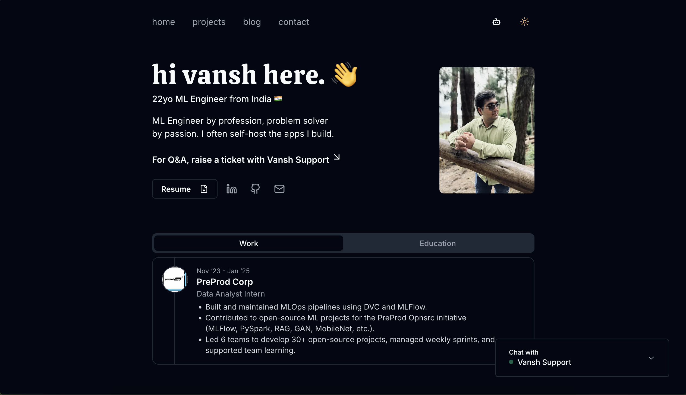

# Vansh's Portfolio

A clean, minimal portfolio website built with Next.js, Tailwind CSS, and Shadcn UI. Features an AI chatbot, email contact form, and blog.

🌐 Live: **[https://vanshraja.me](https://vanshraja.me)**

## About

Hi, I'm Vansh! This is my personal portfolio to showcase my work, projects, and thoughts. You'll find my latest projects, blogs, and a fun AI chatbot to know more about me. Feel free to explore and connect!

## Features

- Minimal, modern design
- Light/dark mode toggle
- AI chatbot trained on my portfolio content
- Contact form with email integration
- Responsive mobile design
- Blog section

## Tech Stack

- Next.js
- Tailwind CSS
- Shadcn UI
- OpenAI API (chatbot)
- Vercel (hosting)
- AstraDB (vector storage)
- Upstash (caching)
- Resend (email)

## License

MIT. Portions of this project are based on the original work by Ang Wei Feng (Ted) ([tedawf.com](https://tedawf.com)), used under the MIT License. Significant modifications and ongoing maintenance by Vansh ([vanshraja.me](https://vanshraja.me)).

See [LICENSE.txt](LICENSE.txt) for details.

## Repository

[https://github.com/Vansh-Raja/Portfolio.git](https://github.com/Vansh-Raja/Portfolio.git)

